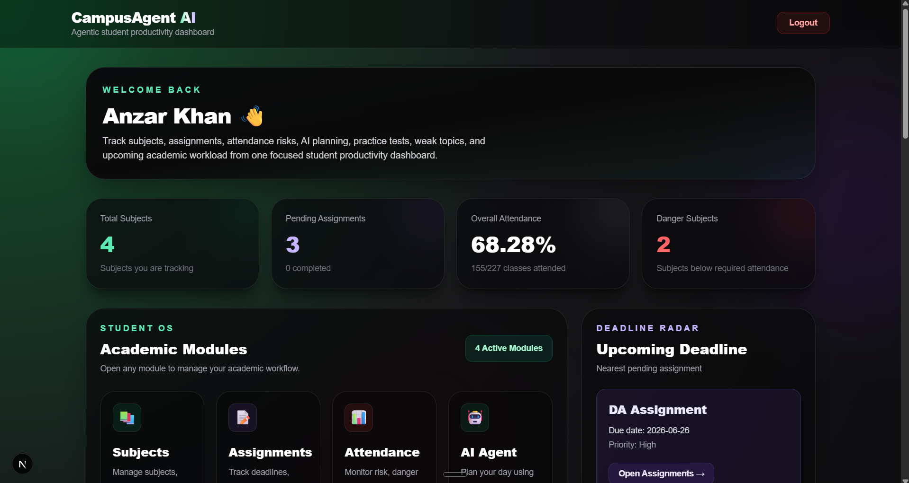
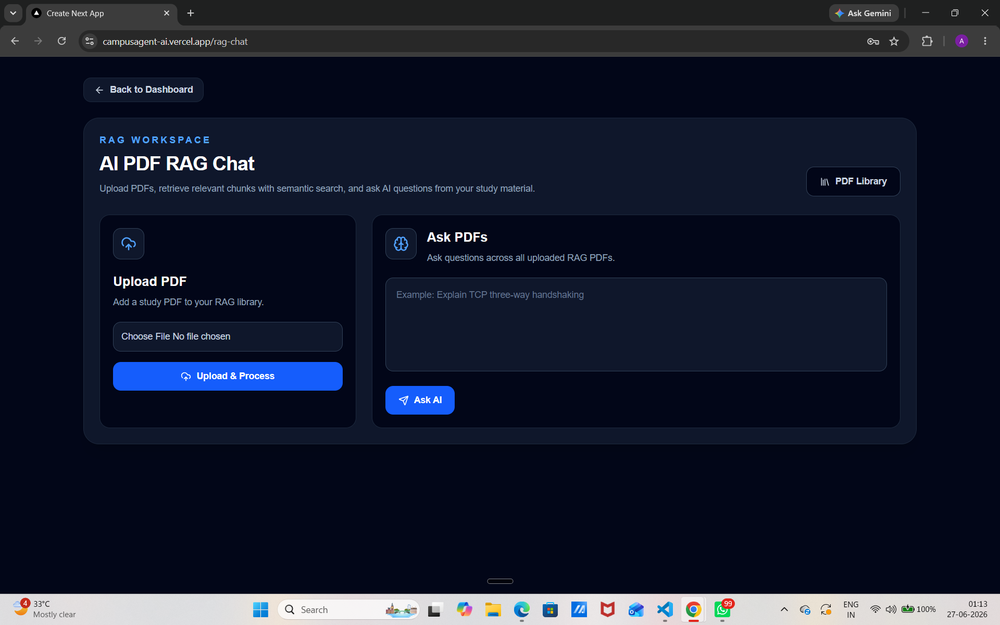
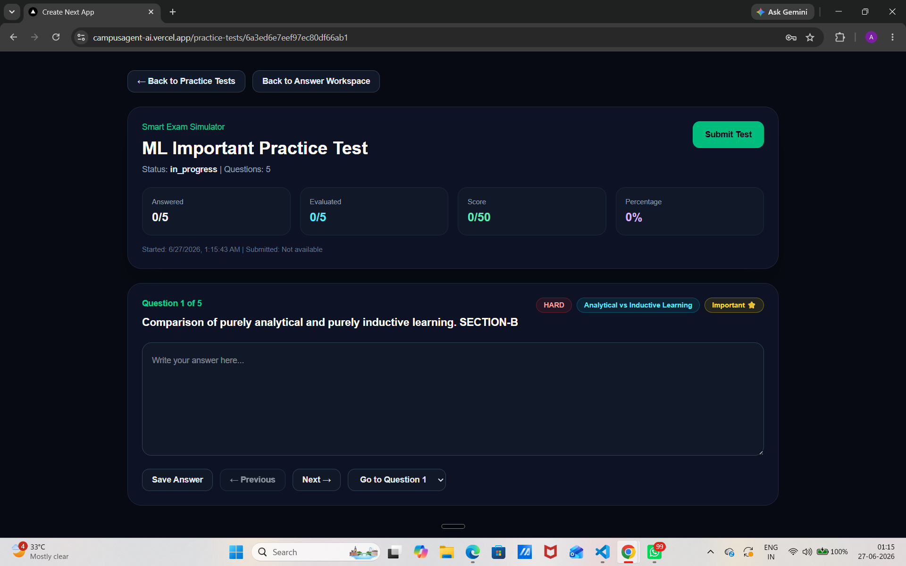
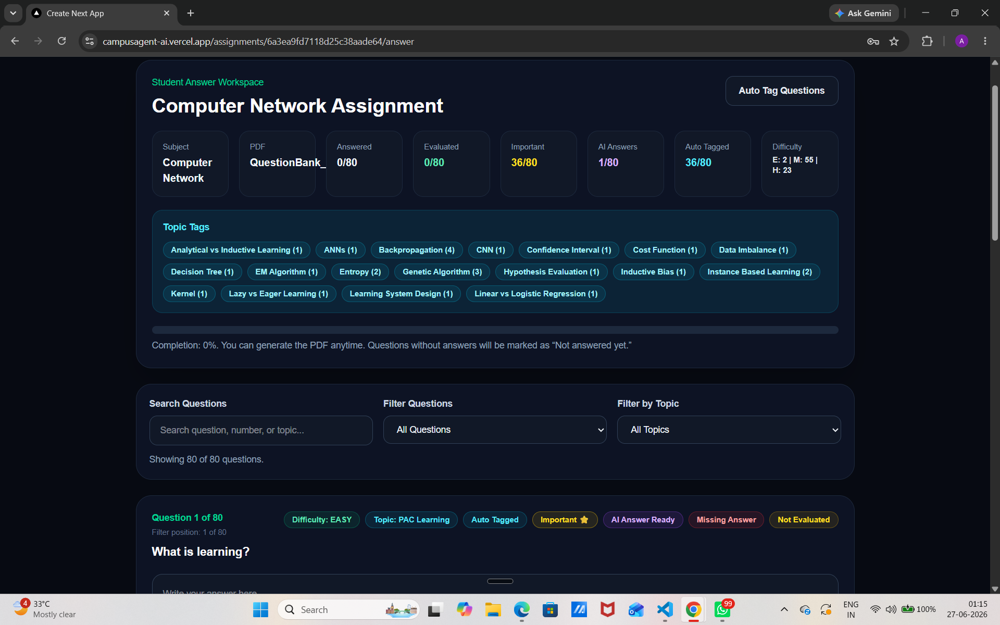
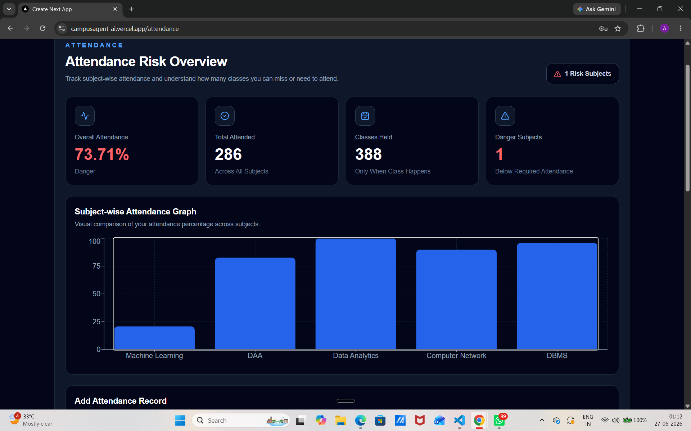
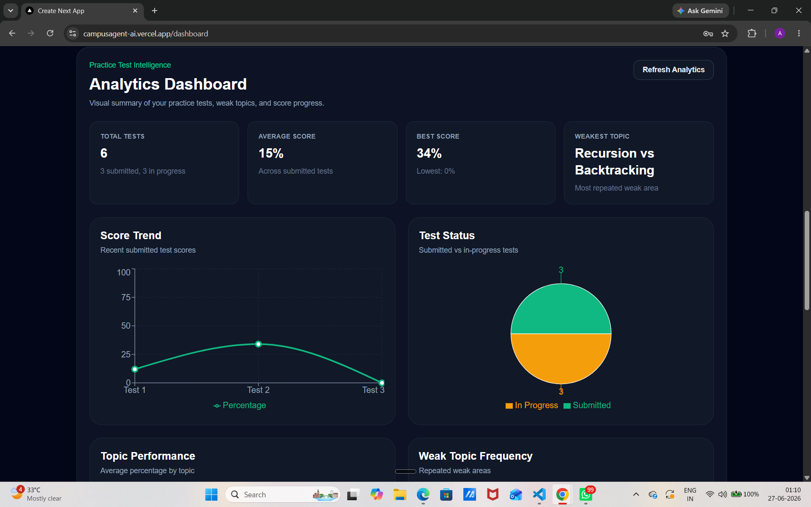
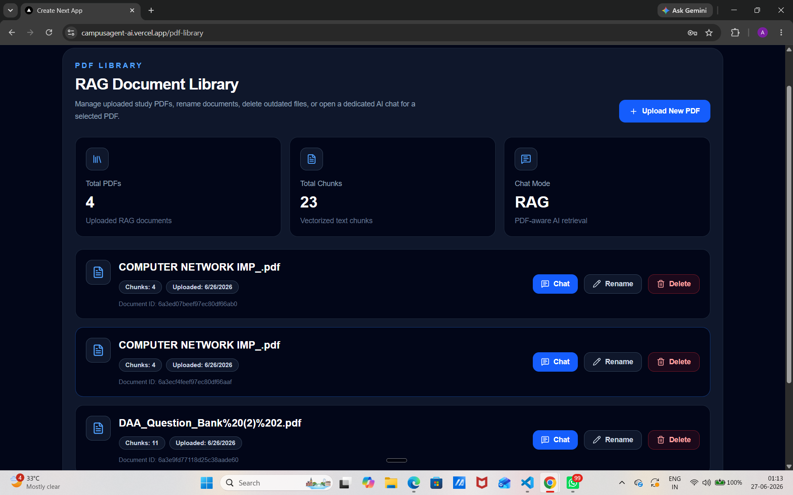
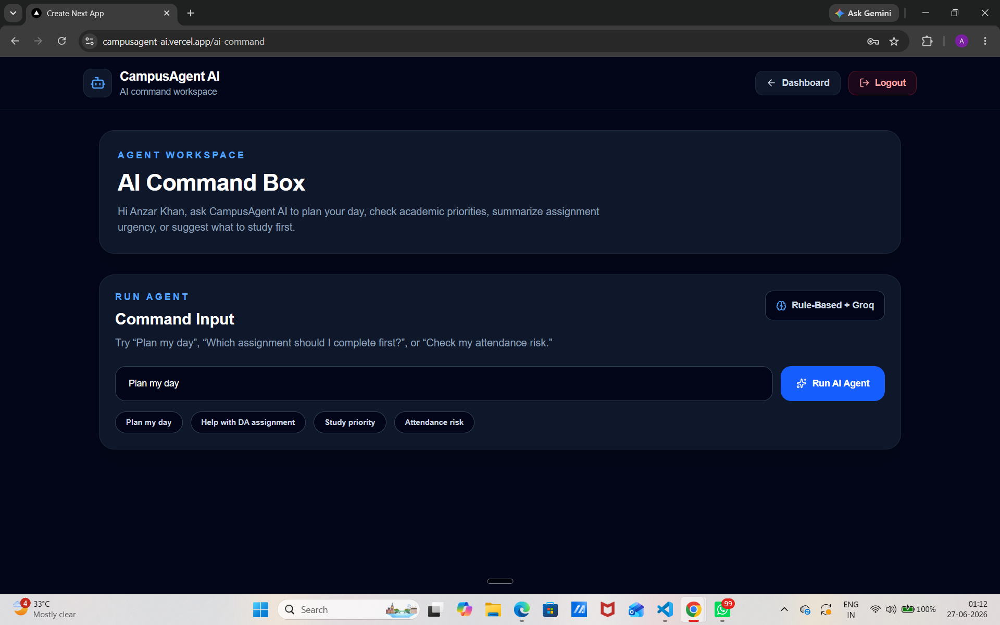
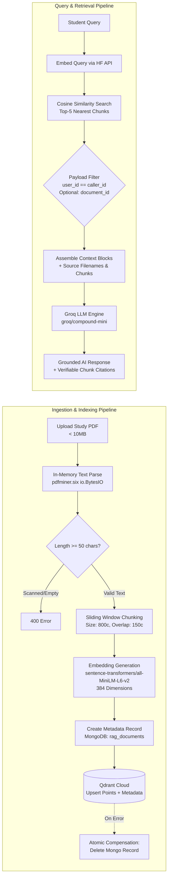
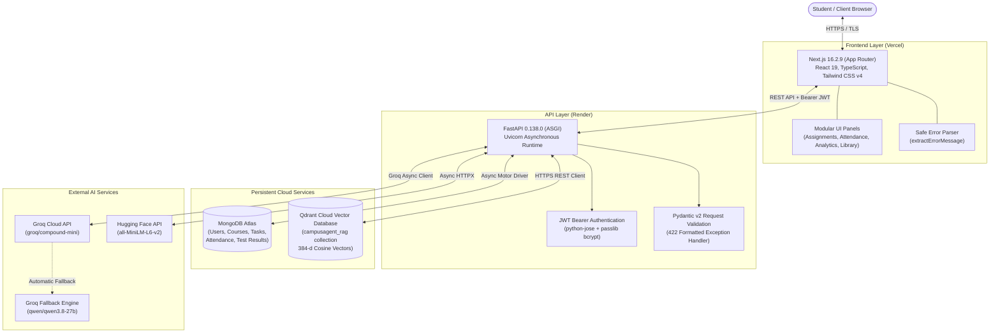

# CampusAgent AI

> An agentic AI-powered student productivity platform that combines academic management, intelligent document understanding, RAG-powered study assistance, parallelized AI test evaluation, and natural-language productivity workflows.

[](https://nextjs.org/)
[](https://fastapi.tiangolo.com/)
[](https://react.dev/)
[](https://www.typescriptlang.org/)
[](https://www.python.org/)
[](https://www.mongodb.com/atlas)
[](https://qdrant.tech/)
[](https://groq.com/)
[](https://campusagent-ai-backend.onrender.com/health)

---

## 🌐 Live Production Deployments

| Component | Provider | Live URL | Endpoint Documentation |
| :--- | :--- | :--- | :--- |
| **Web Application** | Vercel | [https://campusagent-ai.vercel.app](https://campusagent-ai.vercel.app) | [Sign In / Register](https://campusagent-ai.vercel.app/login) |
| **Backend REST API** | Render | [https://campusagent-ai-backend.onrender.com](https://campusagent-ai-backend.onrender.com) | [Liveness Probe (`/health`)](https://campusagent-ai-backend.onrender.com/health) |
| **Interactive API Docs** | Render / Swagger | [https://campusagent-ai-backend.onrender.com/docs](https://campusagent-ai-backend.onrender.com/docs) | [Readiness Probe (`/ready`)](https://campusagent-ai-backend.onrender.com/ready) |
| **Source Repository** | GitHub | [https://github.com/AnzarKhan855/campusagent-ai](https://github.com/AnzarKhan855/campusagent-ai) | Main Branch |

---

## 📖 Product Overview

### The Problem
Engineering students face cognitive overload from fragmented academic tools:
- **Scattered Study Materials**: Lecture slides, assignment sheets, and reference textbooks are siloed in download folders.
- **Attendance Anxiety**: Manual calculations are required to determine whether an absence violates the mandatory minimum attendance percentage (typically 75%).
- **Superficial LLM Assistance**: Standard consumer LLMs lack grounding in specific course syllabi, resulting in hallucinations and inaccurate academic answers.
- **Disconnected Practice**: Students lack mechanisms to generate practice examinations directly from their uploaded coursework with objective, rubric-based automated grading.

### The Solution
**CampusAgent AI** consolidates academic planning, course tracking, and generative AI into a unified platform:
1. **RAG-Powered Document Intelligence**: Students upload lecture and textbook PDFs (up to 10 MB). The platform chunks, embeds, and stores them in Qdrant Cloud, allowing students to ask complex academic questions with verifiable, grounded citations.
2. **Attendance Intelligence**: Computes current standing and dynamically calculates the exact number of classes a student can safely miss or must attend consecutively to restore academic compliance.
3. **Automated Practice Test & Grading Engine**: Converts assignment questions into practice tests, evaluates student submissions in parallel using bounded worker pools (`asyncio.Semaphore`), delivers rubric-based score breakdowns (0–10), and tracks weak topics over time.
4. **AI Command Agent**: Interprets natural language instructions to create subjects, inspect upcoming deadlines, and plan study routines with built-in safety guardrails against destructive operations.

---

## 📸 Product Showcase

<div align="center">

### Executive Dashboard

*Consolidated academic view showing subject count, assignment status, attendance health, and upcoming deadlines.*

---

### RAG Document Intelligence & Semantic Q&A

*Context-grounded document chat with source citation metadata and similarity score attribution.*

---

### Practice Test Examination & AI Grading

*Interactive testing engine with automated AI grading, strength analysis, and missing-point identification.*

---

### Assignment Workspace & Solution Studio

*Structured assignment interface supporting student drafts, AI model answers, and ReportLab PDF compilation.*

---

### Mathematical Attendance Analytics

*Real-time compliance monitoring calculating safe absence margins and recovery class requirements.*

---

### Weak Topic Identification & Academic Progress

*Visual performance breakdown using Recharts radar and bar charts to isolate subjects requiring revision.*

---

### PDF Document Library

*Multi-tenant document repository managing embedded course materials with atomic storage synchronization.*

---

### Natural Language AI Command Center

*Conversational agent executing workspace actions and deadline queries with safety guardrails.*

</div>

---

## ⚡ Feature Matrix

| Capability | Module / Layer | Technical Implementation | Status |
| :--- | :--- | :--- | :--- |
| **JWT Authentication** | Backend / Frontend | Stateless JSON Web Tokens (`python-jose`), bcrypt password hashing, HTTPBearer guardrails | Verified Active |
| **Course Management** | `/api/subjects` | Multi-tenant course CRUD with case-insensitive uniqueness validation and color categorization | Verified Active |
| **Assignment Tracking** | `/api/assignments` | Priority, deadline parsing, status pipelines, and ReportLab PDF document export | Verified Active |
| **PDF Extraction** | Assignment Workspace | In-memory text extraction (`pdfminer.six`, `PyMuPDF`) with automated question identification | Verified Active |
| **Attendance Intelligence** | `/api/attendance` | Dynamic compliance modeling (`classes_can_miss` vs. `classes_needed` recovery formula) | Verified Active |
| **Document RAG** | `/api/rag` | Sliding-window chunking (800c/150o), 384-d MiniLM embeddings, Qdrant Cloud vector search | Verified Active |
| **Tenant Isolation** | RAG & Mongo | Mandatory `user_id` metadata filtering and keyword payload indexing in Qdrant and MongoDB | Verified Active |
| **Parallel Test Grading** | `/api/practice-tests` | Bounded concurrent evaluation (`asyncio.Semaphore(4)`) grading tests with score breakdowns | Verified Active |
| **AI Command Agent** | `/api/ai` | Natural language intent dispatcher with guardrails blocking destructive/bulk operations | Verified Active |
| **Weak Topic Radar** | Analytics Dashboard | Automated performance aggregation isolating topics scoring $< 60\%$ on practice tests | Verified Active |
| **Fault-Tolerant AI** | `ai_config.py` | Primary model (`groq/compound-mini`) with automatic fallback (`qwen/qwen3.8-27b`) and 429 handling | Verified Active |

---

## 🧠 Retrieval-Augmented Generation (RAG) Pipeline

CampusAgent AI implements a production-grade RAG pipeline designed for low latency, tenant safety, and hallucination prevention.



### Key RAG Engineering Highlights:
- **In-Memory Parsing**: File bytes are streamed into `io.BytesIO`, eliminating disk file locks and temporary folder persistence issues on cloud hosting providers.
- **Tenant Isolation**: Every vector point contains `user_id` and `document_id`. All similarity searches and point deletions enforce strict `FieldCondition` keyword filtering.
- **Atomic Compensation Rollback**: If Qdrant insertion fails after creating the MongoDB document record, the backend catches the error and executes an immediate rollback deletion, preventing orphaned records.
- **Hallucination Guardrails**: Prompts explicitly constrain the LLM: *"Answer using only the provided PDF context. If the answer is not present, state that the answer is not available in the uploaded document."*

---

## 🏗️ System Architecture



For detailed sequence diagrams, schema topologies, and concurrency models, see [docs/ARCHITECTURE.md](docs/ARCHITECTURE.md).

---

## 🛠️ Technology Stack

| Layer | Technology | Version | Architectural Responsibility |
| :--- | :--- | :--- | :--- |
| **Frontend Framework** | Next.js | `16.2.9` | App Router, Server/Client components, Turbopack builds |
| **Frontend UI** | React | `19.2.4` | Component state management and responsive DOM rendering |
| **Type Safety** | TypeScript | `^5.0.0` | Strict compile-time interface and type enforcement |
| **Styling** | Tailwind CSS | `^4.0.0` | Utility-first styling via modern `@tailwindcss/postcss` |
| **Data Visualization** | Recharts | `^3.9.0` | Radar charts (weak topics) and bar charts (attendance analytics) |
| **UI Icons** | Lucide React | `^1.21.0` | Accessible SVG icon library |
| **Backend Framework** | FastAPI | `0.138.0` | High-performance asynchronous Python REST API |
| **ASGI Server** | Uvicorn | `0.49.0` | Production ASGI web server runtime |
| **Database Driver** | Motor / PyMongo | `3.7.1` / `4.17.0` | Asynchronous non-blocking MongoDB communication |
| **Database** | MongoDB Atlas | Cloud M0+ | Multi-tenant document database for user and academic data |
| **Vector Database** | Qdrant Cloud | Cloud Cluster | 384-dimensional dense vector indexing and cosine similarity |
| **LLM Provider** | Groq Cloud | `groq 1.5.0` | Ultra-low latency LLM inference engine |
| **Primary LLM** | `groq/compound-mini` | Production | Primary model for answers, commands, and question extraction |
| **Fallback LLM** | `qwen/qwen3.8-27b` | Production | Automatic fallback model for resiliency and 429 handling |
| **Embedding Model** | all-MiniLM-L6-v2 | 384-dim | Feature extraction for semantic similarity and RAG search |
| **PDF Extraction** | pdfminer.six / PyMuPDF | `20260107` / `1.27.2` | In-memory text parsing and question segmentation |
| **PDF Compilation** | ReportLab | `5.0.0` | Dynamic server-side assignment solution PDF export |
| **Authentication** | python-jose / passlib | `3.5.0` / `1.7.4` | JWT token signing, claims verification, and bcrypt hashing |

---

## 📁 Repository Structure

```text
campusagent-ai/
├── .github/                           # Repository workflows and issue templates
├── backend/                           # FastAPI backend application
│   ├── app/
│   │   ├── rag/                       # RAG subsystem
│   │   │   ├── chunker.py             # Sliding-window character chunking
│   │   │   ├── embeddings.py          # Hugging Face API & deterministic embedding fallback
│   │   │   ├── pdf_library_service.py # MongoDB document metadata operations
│   │   │   ├── rag_models.py          # Pydantic schemas for RAG requests
│   │   │   ├── rag_routes.py          # RAG endpoints (/api/rag/*)
│   │   │   ├── rag_service.py         # Ingestion, validation, and grounded Q&A
│   │   │   └── vector_store.py        # Qdrant client, payload indexes, and point operations
│   │   ├── ai_config.py               # Centralized Groq LLM setup, fallback, & JSON parser
│   │   ├── auth.py                    # JWT token creation, decoding, & bcrypt hashing
│   │   ├── database.py                # Motor MongoDB connection & collection registry
│   │   ├── main.py                    # FastAPI entrypoint, CORS, exception handlers, & health
│   │   ├── models.py                  # Core Pydantic request & response schemas
│   │   ├── routes_ai.py               # Natural language AI Command Agent router
│   │   ├── routes_assignments.py      # Assignment CRUD, question extraction, & ReportLab PDF
│   │   ├── routes_attendance.py       # Attendance tracking & mathematical risk engine
│   │   ├── routes_auth.py             # User signup, login, & profile router
│   │   ├── routes_dashboard.py        # Consolidated academic overview metrics router
│   │   ├── routes_practice_tests.py   # Practice test generator & parallel grading engine
│   │   └── routes_subjects.py         # Academic subject management router
│   └── requirements.txt               # Backend Python dependencies
├── docs/                              # Technical architecture and design documentation
│   └── ARCHITECTURE.md                # System topology, sequence diagrams, and mathematical models
├── frontend/                          # Next.js frontend web application
│   ├── public/                        # Static web assets & icons
│   ├── src/
│   │   ├── app/                       # App Router page components & layouts
│   │   ├── components/                # Modular UI components (Panels & Analytics)
│   │   └── lib/
│   │       └── error.ts               # Safe error parser for API validation exceptions
│   ├── package.json                   # Frontend dependencies & scripts
│   ├── tsconfig.json                  # TypeScript compiler configuration
│   └── README.md                      # Frontend-specific documentation
├── screenshots/                       # Verified application UI screenshots
├── .env.example                       # Centralized sanitized environment variable template
├── .gitignore                         # Git exclusion rules
├── CONTRIBUTING.md                    # Contributor guide & commit conventions
├── SECURITY.md                        # Security policies & vulnerability reporting
└── README.md                          # Master project documentation
```

---

## 📐 Mathematical Attendance Model

The attendance intelligence engine evaluates student attendance against a configurable target percentage (default: $75\%$):

$$\text{Current Percentage} = \text{round}\left(\frac{\text{Attended Classes}}{\text{Total Classes}} \times 100, 2\right)$$

### Risk Classifications:
- **Safe** ($\text{Current} \ge \text{Target} + 10\%$): Strong attendance cushion.
- **Warning** ($\text{Target} \le \text{Current} < \text{Target} + 10\%$): Vulnerable to sudden absence.
- **Danger** ($\text{Current} < \text{Target}$): Attendance shortage; student is debarred/at risk.

### Dynamic Recovery & Absence Formulas:
1. **Classes Allowed to Miss** (When $\text{Current} \ge \text{Target}$):
   $$\text{Classes Can Miss} = \left\lfloor \frac{\text{Attended Classes} \times 100}{\text{Target Percentage}} \right\rfloor - \text{Total Classes}$$
2. **Consecutive Classes Required to Recover** (When $\text{Current} < \text{Target}$):
   $$\text{Classes Needed} = \left\lceil \frac{(\text{Target Percentage} \times \text{Total Classes}) - (100 \times \text{Attended Classes})}{100 - \text{Target Percentage}} \right\rceil$$

---

## 🔌 API Reference

Interactive OpenAPI / Swagger documentation is available in production at [https://campusagent-ai-backend.onrender.com/docs](https://campusagent-ai-backend.onrender.com/docs).

### System & Health Endpoints
| Method | Endpoint | Description | Auth Required |
| :--- | :--- | :--- | :--- |
| `GET` | `/` | Service root verification | No |
| `GET` | `/health` | Liveness check (MongoDB ping + Qdrant connectivity status) | No |
| `GET` | `/ready` | Readiness probe (validates DB, vector connectivity, and cloud persistence) | No |
| `GET` | `/db-test` | Diagnostic collection verification | No |

### Authentication (`/api/auth`)
| Method | Endpoint | Description | Auth Required |
| :--- | :--- | :--- | :--- |
| `POST` | `/api/auth/signup` | Register new student account (bcrypt hashing, issues JWT) | No |
| `POST` | `/api/auth/login` | Authenticate credentials and return JWT bearer token | No |
| `GET` | `/api/auth/me` | Fetch authenticated user profile (excludes password hash) | **Yes (Bearer)** |

### Subjects (`/api/subjects`)
| Method | Endpoint | Description | Auth Required |
| :--- | :--- | :--- | :--- |
| `POST` | `/api/subjects` | Create subject with case-insensitive duplicate prevention | **Yes (Bearer)** |
| `GET` | `/api/subjects` | List all academic subjects belonging to the authenticated user | **Yes (Bearer)** |
| `PATCH` | `/api/subjects/{id}` | Update subject name, code, teacher, or color tag | **Yes (Bearer)** |
| `DELETE` | `/api/subjects/{id}` | Delete subject (verifies user ownership) | **Yes (Bearer)** |

### Assignments & Workspace (`/api/assignments`)
| Method | Endpoint | Description | Auth Required |
| :--- | :--- | :--- | :--- |
| `POST` | `/api/assignments` | Create assignment with title, subject, due date, and priority | **Yes (Bearer)** |
| `GET` | `/api/assignments` | List all user assignments | **Yes (Bearer)** |
| `GET` | `/api/assignments/{id}` | Fetch full assignment details including extracted questions | **Yes (Bearer)** |
| `PATCH` | `/api/assignments/{id}` | Update assignment status, due date, or priority | **Yes (Bearer)** |
| `POST` | `/api/assignments/{id}/upload-pdf` | Upload and in-memory parse assignment PDF | **Yes (Bearer)** |
| `POST` | `/api/assignments/{id}/extract-questions` | LLM-powered question extraction from assignment text | **Yes (Bearer)** |
| `PATCH` | `/api/assignments/{id}/questions/save-answer` | Persist student written response for a specific question | **Yes (Bearer)** |
| `PATCH` | `/api/assignments/{id}/questions/mark-important` | Toggle high-priority exam flag on a question | **Yes (Bearer)** |
| `PATCH` | `/api/assignments/{id}/questions/update-difficulty` | Set question difficulty rating (`easy` / `medium` / `hard`) | **Yes (Bearer)** |
| `PATCH` | `/api/assignments/{id}/questions/auto-tag` | AI auto-classifies difficulty and exam importance | **Yes (Bearer)** |
| `PATCH` | `/api/assignments/{id}/questions/generate-ai-answer` | Generate structured AI model solution for a question | **Yes (Bearer)** |
| `PATCH` | `/api/assignments/{id}/questions/evaluate-answer` | Rubric-based AI grading of student answer (score + feedback) | **Yes (Bearer)** |
| `GET` | `/api/assignments/{id}/generate-pdf` | Stream dynamic PDF assignment solution sheet (ReportLab) | **Yes (Bearer)** |
| `DELETE` | `/api/assignments/{id}/delete-pdf` | Delete attached assignment PDF file | **Yes (Bearer)** |
| `DELETE` | `/api/assignments/{id}` | Delete assignment and associated data | **Yes (Bearer)** |

### Attendance Intelligence (`/api/attendance`)
| Method | Endpoint | Description | Auth Required |
| :--- | :--- | :--- | :--- |
| `POST` | `/api/attendance` | Record attendance (total classes, attended, required %) | **Yes (Bearer)** |
| `GET` | `/api/attendance` | Retrieve all attendance records with dynamic risk calculations | **Yes (Bearer)** |
| `PUT` | `/api/attendance/{id}` | Update total and attended class counts | **Yes (Bearer)** |
| `DELETE` | `/api/attendance/{id}` | Delete attendance record | **Yes (Bearer)** |

### Dashboard & Analytics
| Method | Endpoint | Description | Auth Required |
| :--- | :--- | :--- | :--- |
| `GET` | `/api/dashboard/overview` | Aggregated metrics: pending tasks, overdue count, attendance risk | **Yes (Bearer)** |
| `GET` | `/api/practice-tests/analytics/dashboard-summary` | Practice test performance, topic accuracy, and weak topic radar | **Yes (Bearer)** |

### Practice Tests (`/api/practice-tests`)
| Method | Endpoint | Description | Auth Required |
| :--- | :--- | :--- | :--- |
| `POST` | `/api/assignments/{id}/practice-tests/create` | Generate practice examination from assignment questions | **Yes (Bearer)** |
| `GET` | `/api/assignments/{id}/practice-tests` | List all practice tests generated for an assignment | **Yes (Bearer)** |
| `GET` | `/api/practice-tests/{test_id}` | Retrieve examination questions and current draft answers | **Yes (Bearer)** |
| `PATCH` | `/api/practice-tests/{test_id}/save-answer` | Save draft response during active exam session | **Yes (Bearer)** |
| `POST` | `/api/practice-tests/{test_id}/submit` | Submit test for parallelized AI grading (`asyncio.Semaphore(4)`) | **Yes (Bearer)** |

### AI Command Center (`/api/ai`)
| Method | Endpoint | Description | Auth Required |
| :--- | :--- | :--- | :--- |
| `POST` | `/api/ai/command` | Natural language agent dispatching workspace actions & guidance | **Yes (Bearer)** |

### Document RAG Subsystem (`/api/rag`)
| Method | Endpoint | Description | Auth Required |
| :--- | :--- | :--- | :--- |
| `POST` | `/api/rag/upload` | Upload PDF (max 10MB), chunk, embed, and store in Qdrant | **Yes (Bearer)** |
| `GET` | `/api/rag/documents` | List all processed PDF documents in user library | **Yes (Bearer)** |
| `PATCH` | `/api/rag/documents/{id}/rename` | Rename document in library | **Yes (Bearer)** |
| `DELETE` | `/api/rag/documents/{id}` | Delete document metadata from Mongo and vectors from Qdrant | **Yes (Bearer)** |
| `POST` | `/api/rag/ask` | Context-grounded semantic search across uploaded PDF materials | **Yes (Bearer)** |

---

## ⚙️ Local Development Setup

### Prerequisites
- **Node.js**: `v18.18.0` or later (tested on Node 20+)
- **Python**: `3.10` or later (tested on Python 3.13)
- **MongoDB Atlas**: Free M0 cluster or local MongoDB instance
- **Groq API Key**: Free tier available at [console.groq.com](https://console.groq.com/)
- **Qdrant Cloud** *(Optional)*: Free tier available at [cloud.qdrant.io](https://cloud.qdrant.io/) (falls back to local embedded storage)
- **Hugging Face Token** *(Optional)*: Free read token at [huggingface.co/settings/tokens](https://huggingface.co/settings/tokens)

### 1. Clone the Repository
```bash
git clone https://github.com/AnzarKhan855/campusagent-ai.git
cd campusagent-ai
```

### 2. Backend Setup
```bash
cd backend
python -m venv venv

# Activate Virtual Environment:
# On Windows (PowerShell):
venv\Scripts\Activate.ps1
# On macOS / Linux:
source venv/bin/activate

# Install Dependencies:
pip install -r requirements.txt

# Configure Environment Variables:
cp ../.env.example .env
```
Edit `backend/.env` with your credentials:
```env
MONGODB_URL=mongodb+srv://<username>:<password>@cluster.mongodb.net/?retryWrites=true&w=majority
DATABASE_NAME=campusagent
JWT_SECRET_KEY=your_cryptographically_secure_random_key_here
GROQ_API_KEY=gsk_your_groq_api_key_here
HF_TOKEN=hf_your_hugging_face_token_here
QDRANT_URL=https://your-cluster.cloud.qdrant.io:6333
QDRANT_API_KEY=your_qdrant_api_key_here
```

Start the FastAPI backend:
```bash
uvicorn app.main:app --reload --port 8000
```
Backend will be live at `http://127.0.0.1:8000`. Test the health probe at `http://127.0.0.1:8000/health`.

### 3. Frontend Setup
In a separate terminal:
```bash
cd frontend
npm install

# Configure Environment Variables:
cp ../.env.example .env.local
```
Edit `frontend/.env.local`:
```env
NEXT_PUBLIC_API_BASE_URL=http://127.0.0.1:8000
NEXT_PUBLIC_API_URL=http://127.0.0.1:8000
```

Start the Next.js development server:
```bash
npm run dev
```
Open [http://localhost:3000](http://localhost:3000) in your browser.

---

## 🔒 Security Architecture

CampusAgent AI implements defence-in-depth principles across all tiers. For full disclosure guidelines, refer to [SECURITY.md](SECURITY.md).

1. **Stateless JWT Authentication**: Tokens are signed using `HS256` with configurable expiration. User passwords are encrypted using `bcrypt` and stripped from all serialized responses.
2. **Multi-Tenant Isolation**: 
   - All MongoDB queries strictly filter by `{"user_id": current_user["_id"]}`.
   - All Qdrant similarity searches and deletions enforce mandatory keyword filtering on `user_id`.
3. **In-Memory Document Ingestion**: Uploaded PDFs are parsed entirely in memory via `io.BytesIO`. Temporary files are never written to unmanaged disk sectors.
4. **Ingestion Quotas**: File uploads are restricted to a maximum size of 10 MB and must yield $\ge 50$ characters of text, preventing resource exhaustion from corrupt or non-text PDFs.
5. **Atomic Compensation**: If vector storage fails during ingestion, the created MongoDB document metadata is rolled back immediately to prevent ghost records.
6. **Destructive Command Guardrails**: The natural language AI Command Agent inspects incoming prompts against safety filters, rejecting commands that attempt mass deletion (e.g., `delete all`, `drop table`, `wipe database`).
7. **Safe Error Serialization**: The frontend implements a specialized parsing utility (`lib/error.ts`) ensuring nested FastAPI HTTP 422 validation error arrays never trigger uncaught JavaScript runtime exceptions.

---

## 🧪 Testing & Production Validation

### Automated Verification
- **Frontend Production Build**: Successfully compiles with Turbopack and passes strict TypeScript validation (`npm run build` exits 0 with 13 prerendered/dynamic routes).
- **Backend Import Verification**: All FastAPI routers, Pydantic schemas, and RAG services import cleanly in Python 3.13+.
- **Secret Scan**: Automated scans verify zero private keys, database passwords, or API credentials exist in git history or tracked repository files.

### Production Probes & Live Verification
The production deployment on Render and Vercel has been validated against active readiness checks:

```bash
# Query Production Readiness Probe
curl https://campusagent-ai-backend.onrender.com/ready
```

**Verified Response:**
```json
{
  "ready": true,
  "service": "CampusAgent AI Backend",
  "database": "connected",
  "vector_store": "remote_qdrant_cloud",
  "vector_connectivity": "connected",
  "persistent": true,
  "blockers": []
}
```

---

## ⚠️ Current Engineering Limitations

In the interest of technical honesty and engineering credibility:
1. **Scanned / Image-Only PDFs**: The current PDF ingestion engine uses `pdfminer.six` and `PyMuPDF` for digital text extraction. Scanned document PDFs containing rasterized images without an embedded text layer are rejected by the $\ge 50$ character minimum text validation rule (OCR pipeline is planned on the roadmap).
2. **Synchronous Ingestion Latency**: Embedding generation for documents approaching the 10 MB ceiling executes synchronously during the upload request. While acceptable for typical study handouts (10–50 pages), exceptionally large textbooks can experience 10–25s request durations depending on external embedding API latency.
3. **Cloud Vector Store Dependency**: For persistent storage across container restarts on ephemeral platforms (e.g. Render free dynos), `QDRANT_URL` and `QDRANT_API_KEY` must be configured. If unconfigured, the application gracefully operates in local embedded mode (`qdrant_storage`), but flags the persistence risk through its `/ready` probe.

---

## 🗺️ Roadmap

### ✅ Completed
- [x] Full-stack architecture with Next.js 16 (App Router) and FastAPI.
- [x] JWT authentication with bcrypt password hashing and user profile management.
- [x] Multi-tenant subject and assignment CRUD operations.
- [x] In-memory PDF text extraction and automated question parsing.
- [x] Mathematical attendance intelligence with compliance risk warnings and recovery metrics.
- [x] Production RAG pipeline with Qdrant Cloud vector search and source attribution.
- [x] Atomic compensation rollback for RAG ingestion failures.
- [x] Bounded parallel AI grading engine for practice examinations (`asyncio.Semaphore(4)`).
- [x] Natural language AI Command Agent with destructive operation guardrails.
- [x] Centralized Groq model configuration with automatic fallback and 429 rate limit detection.
- [x] Production deployment on Vercel, Render, MongoDB Atlas, and Qdrant Cloud.

### 🔄 In Progress
- [ ] Automated end-to-end test suite using Playwright for frontend and Pytest for backend endpoints.
- [ ] Fine-grained streaming responses (Server-Sent Events) for AI answers and RAG chat.

### 🔮 Planned
- [ ] OCR integration (Tesseract / Vision LLM) for scanned document PDFs.
- [ ] Automated flashcard generation from weak practice test topics.
- [ ] Cross-document synthesis allowing queries across multiple selected PDFs simultaneously.
- [ ] Calendar sync integration (iCal / Google Calendar) for assignment deadlines.

---

## 👨‍💻 Author

**Anzar Khan**  
*B.Tech in Artificial Intelligence & Machine Learning*  
- **GitHub**: [@AnzarKhan855](https://github.com/AnzarKhan855)  
- **Repository**: [campusagent-ai](https://github.com/AnzarKhan855/campusagent-ai)  
- **Live Application**: [campusagent-ai.vercel.app](https://campusagent-ai.vercel.app)

---

## 📄 License & Intellectual Property

This project was built and maintained by Anzar Khan. All source code and intellectual property rights are currently reserved by the author. A formal open-source license (such as MIT or Apache 2.0) may be designated by the repository owner in future releases.
