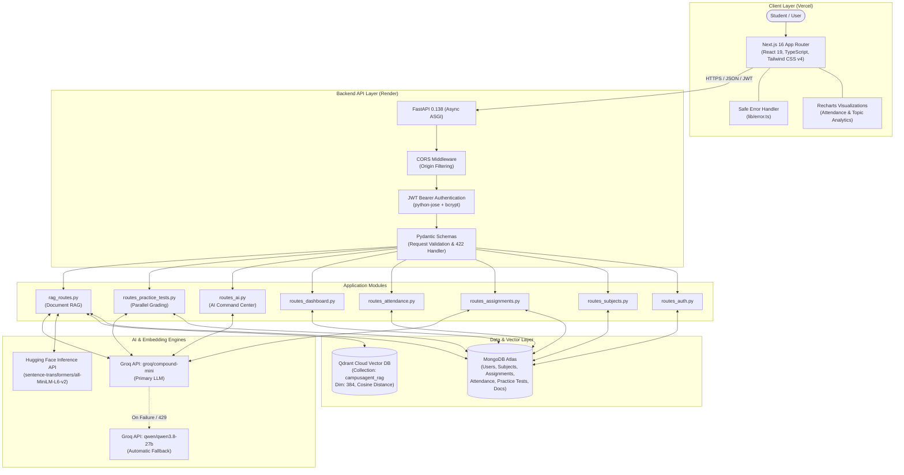
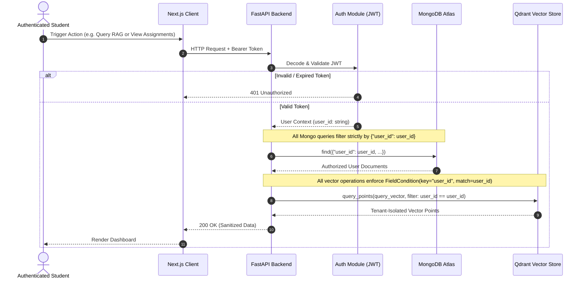
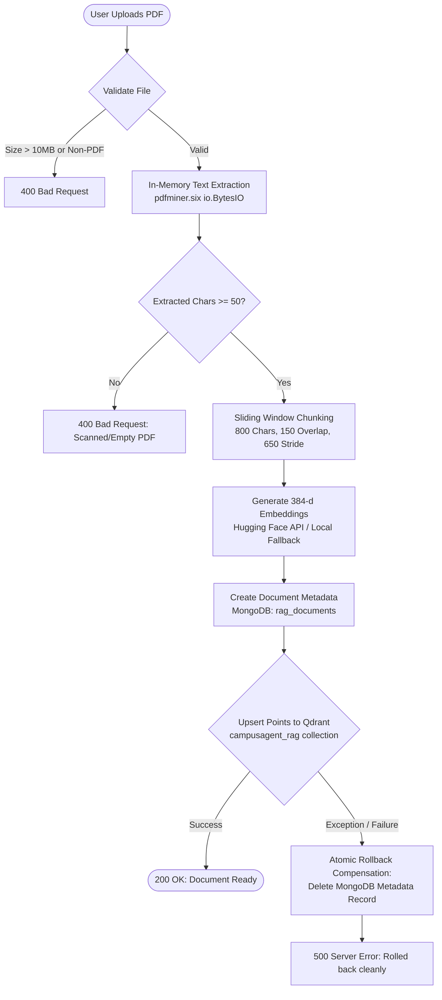

# CampusAgent AI — System Architecture Deep Dive

This document details the architectural design, component interactions, data flows, and security boundaries implemented in **CampusAgent AI**.

---

## 1. High-Level System Architecture

CampusAgent AI is architected as a decoupled client-server application combining an asynchronous REST API backend with a modern React/Next.js frontend, backed by persistent document and vector storage services.



---

## 2. Multi-Tenant Security & Isolation Boundary

Data confidentiality and multi-tenant separation are enforced at the service level across both the document database and the vector store:



---

## 3. RAG Pipeline & Atomic Rollback Compensation

Document ingestion and question answering follow a strict pipeline designed to handle network partitions and prevent orphaned records in MongoDB:



### Retrieval & Grounded Answering

1. **User Query Vectorization**: The query string is embedded into a 384-dimensional dense vector via `get_single_embedding()`.
2. **Filtered Vector Search**: A cosine similarity query is dispatched to Qdrant filtering by `user_id` and optional `document_id`, retrieving the top 5 highest-scoring chunks.
3. **Context Assembly**: The top chunks are formatted with source attribution metadata (`filename`, `chunk_number`, `score`).
4. **Grounded Synthesis**: The context is fed to the Groq LLM with system instructions:
   > *"Answer the student's question using only the provided PDF context. If the answer is not present in the context, say that the answer is not available in the uploaded PDF."*
5. **Payload Response**: The synthesized grounded response is delivered alongside the cited chunk sources.

---

## 4. Practice Test Parallel AI Grading Engine

When a student submits an assignment practice test, evaluating multiple long-form answers sequentially would introduce significant latency. CampusAgent AI employs a bounded asynchronous worker pool:

```python
sem = asyncio.Semaphore(4)  # Limit concurrent LLM evaluation requests

async def eval_single_question(q_idx: int, q_data: dict):
    async with sem:
        # Prompt LLM to evaluate student answer vs assignment context
        # Extract structured score (0-10), strengths, and missing points
        ...

# Execute all evaluations concurrently with bounded concurrency
results = await asyncio.gather(*[eval_single_question(i, q) for i, q in enumerate(questions)])
```

### Analytics Aggregation:
- Computes overall test score (`total_score / max_score * 100`).
- Aggregates accuracy percentages grouped by `topic_tag`.
- Automatically classifies topics below 60% accuracy as **Weak Topics** and feeds them into the analytics dashboard.

---

## 5. Attendance Intelligence & Compliance Recovery Engine

The attendance tracking service mathematically models student compliance against mandatory minimum attendance percentages (default: 75%):

$$\text{Current Percentage} = \text{round}\left(\frac{\text{Attended Classes}}{\text{Total Classes}} \times 100, 2\right)$$

### Risk Classification:
- **Safe**: $\text{Current} \ge \text{Required} + 10\%$
- **Warning**: $\text{Required} \le \text{Current} < \text{Required} + 10\%$
- **Danger**: $\text{Current} < \text{Required}$

### Dynamic Thresholds:
- **Classes Allowed to Miss** (if above threshold):
  $$\text{Classes Can Miss} = \left\lfloor \frac{\text{Attended Classes} \times 100}{\text{Required Percentage}} \right\rfloor - \text{Total Classes}$$
- **Classes Needed to Recover** (if below threshold):
  $$\text{Classes Needed} = \left\lceil \frac{(\text{Required Percentage} \times \text{Total Classes}) - (100 \times \text{Attended Classes})}{100 - \text{Required Percentage}} \right\rceil$$

---

## 6. Production Health & Readiness Verification

CampusAgent AI exposes two specialized lifecycle probes for container orchestrators (Render) and automated monitors:

| Endpoint | Probe Type | Verification Checks | HTTP Success | Degraded / Blocker Condition |
| -------- | ---------- | ------------------- | ------------ | ---------------------------- |
| `GET /health` | Liveness | MongoDB ping, Qdrant cluster ping | 200 OK (`"status": "healthy"`) | DB or Vector unreachable (`"status": "degraded"`) |
| `GET /ready` | Readiness | MongoDB connectivity + Qdrant connectivity + persistent cloud storage verification | 200 OK (`"ready": true`) | Storage is ephemeral container disk or connection down (`"ready": false`) |
